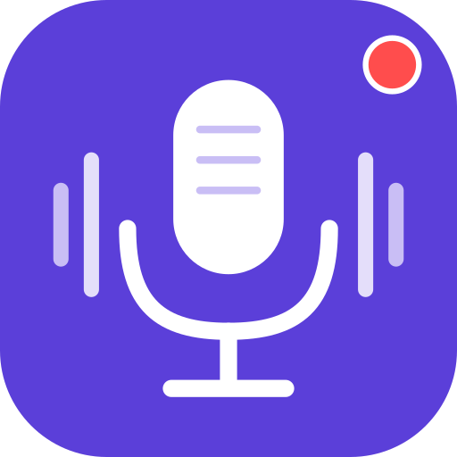
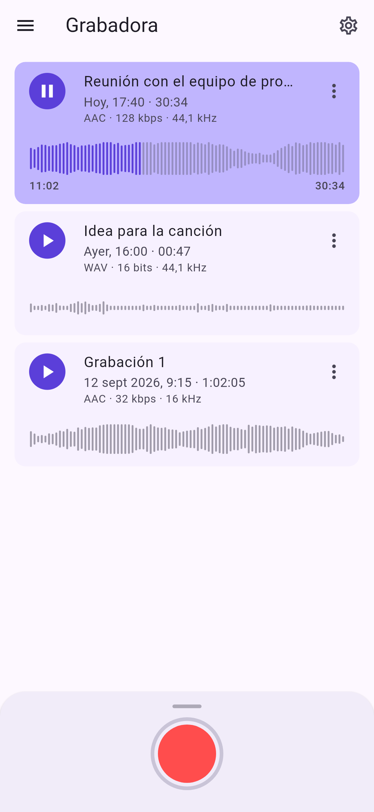
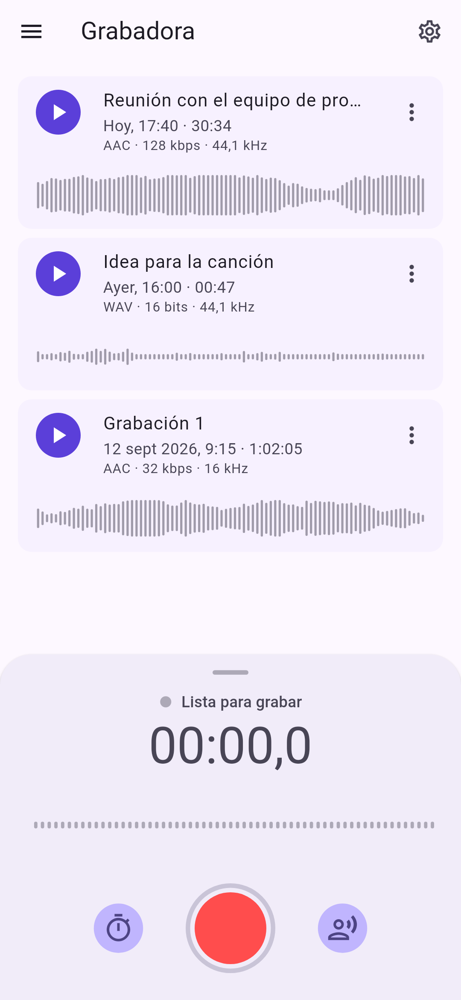
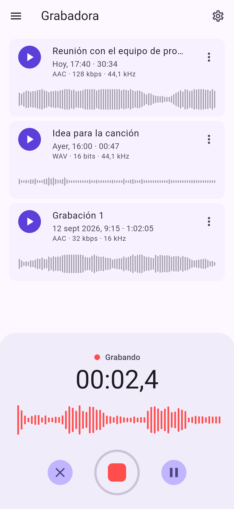
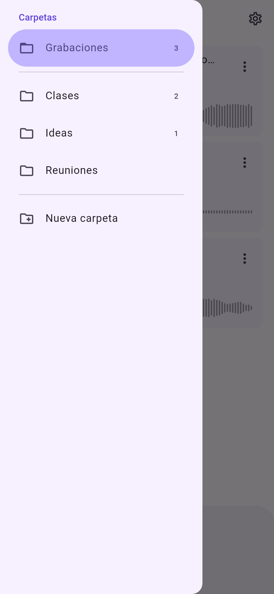
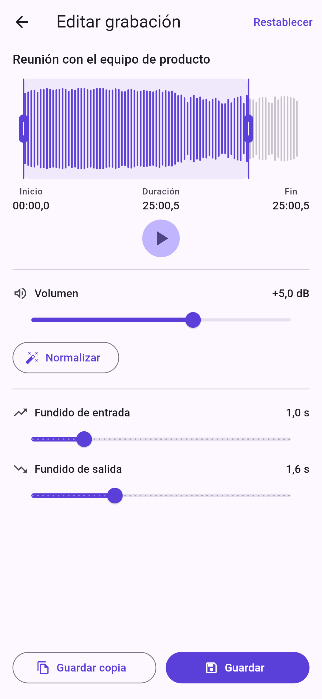

#  Grabadora de voz

Aplicación móvil (Android e iOS) hecha con Flutter para grabar, escuchar y
gestionar notas de voz. Está en español, inglés, italiano, portugués,
francés, alemán, chino y japonés.

<p>
  
  
  
</p>
<p>
  
  
  
</p>

## Funciones

- **Grabar** con un solo toque, con **pausa/reanudar** y cronómetro.
- **Formato y calidad** (*Opciones → Grabación*): AAC (`.m4a`) o WAV sin
  comprimir, en calidad baja, media o alta (ver
  [Formato y calidad](#formato-y-calidad)).
- **Panel deslizable**: al deslizar hacia arriba el panel del botón de grabar
  se ve el cronómetro y la onda (en gris) **sin empezar a grabar**; se graba al
  pulsar el botón. Al deslizarlo hacia abajo se vuelve a plegar. Desplegado,
  a cada lado del botón:
  - ⏱ **Cuenta atrás** (izquierda): empieza a grabar al cabo de 3, 5 o 10 s
    (*Opciones → Grabación → Cuenta atrás*), vibrando cada segundo.
  - 🗣 **Al detectar la voz** (derecha): empieza a grabar cuando hablas y
    conserva **1 s antes** para que no empiece cortada.

  Mientras se espera, la X cancela y el botón rojo empieza ya.
- **Onda en tiempo real** con el nivel del micrófono. Al grabar solo se
  colorea desde el punto en que empieza la grabación; lo anterior sigue en
  gris. En pausa, lo grabado se atenúa.
- **Descartar** una grabación en curso (con confirmación).
- **Lista de grabaciones** ordenada de la más reciente a la más antigua, con
  fecha («Hoy», «Ayer»…), duración, **formato y calidad** («AAC · 128 kbps ·
  44,1 kHz») y la **onda completa de cada una**. **Tocar el nombre** permite
  cambiarlo.
- **Carpetas**: deslizando desde la izquierda (o con ☰) se abre un menú con
  la carpeta principal y sus **subcarpetas**, con cuántas grabaciones tiene
  cada una, y *Nueva carpeta*. La carpeta abierta aparece arriba a la
  izquierda, la lista muestra sus grabaciones y **se graba en ella**. «Atrás»
  vuelve a la principal.
- **Reproductor integrado**: la onda hace de barra de progreso; se puede tocar
  o arrastrar para saltar a cualquier punto (también en grabaciones que no se
  están reproduciendo).
- **Modo de edición** (menú de cada grabación → *Editar*):
  - **Recortar** con dos asas sobre la onda.
  - **Subir o bajar el volumen** (de −20 a +20 dB) y **normalizar** (lleva el
    pico de la selección a −1 dBFS). Avisa si el volumen elegido satura.
  - **Fundido de entrada y de salida** (hasta 5 s).
  - Escuchar la selección antes de guardar, **ya con el volumen y los
    fundidos**.
  - **Guardar** (sustituye la original) o **Guardar copia** (crea una
    grabación nueva, «… (editada)», y deja la original como estaba).
- **Renombrar**, **compartir** (con el nombre que le hayas dado) y
  **eliminar** grabaciones.
- **Opciones** (botón ⚙ arriba a la derecha):
  - **Grabación**: formato, calidad y duración de la cuenta atrás.
  - **Carpeta del dispositivo**: guarda una copia de cada grabación en la
    carpeta que elijas (almacenamiento interno, tarjeta SD, iCloud Drive…) y
    **muestra en la app las grabaciones que ya había en ella** y en sus
    subcarpetas.
  - **Google Drive**: guarda una copia de cada grabación en la carpeta
    «Grabadora» de tu Drive. Necesita configuración previa (ver
    [Google Drive](#google-drive)).
- Tema claro y oscuro según el sistema, con los colores del icono (morado
  `#5B3FD9` y, para grabar, el rojo `#FF4D4D`).
- **Ocho idiomas**: español, inglés, italiano, portugués, francés, alemán,
  chino y japonés. Se usa el del sistema y, si no es ninguno de ellos, el
  inglés (ver [Idiomas](#idiomas)).

Las grabaciones se guardan en la carpeta privada de la app, junto con un
índice `recordings.json` que guarda el nombre, la fecha, la duración, la onda,
el formato, la subcarpeta y el estado de las copias de cada una.

### Formato y calidad

| Calidad | Frecuencia | AAC (`.m4a`) | WAV (16 bits) |
|---------|------------|--------------|---------------|
| Baja    | 16 kHz     | 32 kbps · 0,2 MB/min | 1,9 MB/min |
| Media   | 22,05 kHz  | 64 kbps · 0,5 MB/min | 2,6 MB/min |
| Alta    | 44,1 kHz   | 128 kbps · 1 MB/min  | 5,3 MB/min |

Siempre en mono. Por defecto, AAC alta (lo que se grababa en versiones
anteriores). Si el micrófono o el códec no admiten exactamente esos valores,
`record` usa los más cercanos; la lista muestra los reales, leídos de la
cabecera del archivo.

Solo afecta a las grabaciones nuevas. Al editar, cada grabación conserva su
formato: un WAV se guarda como WAV y un AAC se vuelve a codificar con su tasa
de bits.

### Grabar al detectar la voz

Al pulsar 🗣 el micrófono empieza a grabar sin mostrarlo, para tener el audio
de antes de que hables. La voz se detecta por el nivel del micrófono: cuando
supera en 12 dB el ruido de fondo (que se estima sobre la marcha) y al menos
−45 dBFS durante 200 ms. Al parar, se quita el principio dejando 1 s antes de
la voz: un `.m4a` se recorta sin volver a codificarlo (`MediaMuxer` en
Android, `AVAssetExportSession` en iOS) y un WAV, en Dart. Si el recorte
fallara, la grabación se guarda entera.

### Copias en una carpeta y en Google Drive

La app sigue guardando todo en su carpeta privada (así grabar, reproducir y
editar no depende de permisos ni de la red) y, además, mantiene una copia de
cada grabación en los destinos activados, con el nombre que le hayas dado y
en su subcarpeta (`Clases/Tema 1.m4a`):

- Al grabar, editar o renombrar, la copia se crea, se sobrescribe o se
  renombra. Solo se sube lo que ha cambiado.
- **Lo que ya hay en la carpeta del dispositivo se añade a la app**: al
  elegirla, al volver a la app y con *Copiar ahora*, los audios (`.m4a` y
  `.wav`) de la carpeta y de sus subcarpetas que la app no tiene se copian a
  ella y quedan enlazados a su archivo (renombrarlos o editarlos cambia ese
  archivo). Si al elegir la carpeta hay audios nuevos, se pregunta antes
  (por si es, por ejemplo, una carpeta de música); se puede cambiar después
  con *Mostrar las grabaciones de la carpeta*.
- Las copias propias se reconocen por el nombre y el tamaño, así que volver
  a elegir la misma carpeta no duplica nada.
- En Drive, las subcarpetas se crean dentro de la de la app.
- Si algo falla (sin conexión, permiso retirado…), se reintenta al volver a la
  app o con *Opciones → Copiar ahora*. Los errores se ven en las opciones y con
  un icono en la barra superior.
- **Las copias no se borran** al eliminar una grabación en la app ni al
  desactivar un destino. Una grabación eliminada no se vuelve a añadir desde
  la carpeta.
- Salvo los audios nuevos de la carpeta del dispositivo, que se añaden, es
  una copia en un solo sentido: si cambias o borras directamente en la
  carpeta o en Drive un archivo que ya está en la app, el cambio no vuelve a
  ella. De Drive no se añade nada.

En Android la carpeta se elige con el selector del sistema y el permiso se
conserva entre reinicios. En iOS se usa el selector de archivos (En mi iPhone,
iCloud Drive…) y un marcador de seguridad.

## Requisitos

- Flutter 3.47 o superior (Dart 3.13).
- Android 7.0 (API 24) o superior.
- iOS 15 o superior.

## Cómo ejecutarla

```bash
flutter pub get
flutter run            # en un dispositivo o emulador conectado
```

Para generar los instalables:

```bash
flutter build apk --release   # Android
flutter build ipa             # iOS (requiere macOS y Xcode)
```

> Si no hay clave de firma configurada, el APK de `release` se firma con la
> clave de depuración. Mira [Firma del APK](#firma-del-apk).

## Permisos

- **Android**: `RECORD_AUDIO` e `INTERNET` (para Google Drive), declarados en
  `android/app/src/main/AndroidManifest.xml`. La carpeta de las copias no
  necesita permisos de almacenamiento: el usuario la elige con el selector
  del sistema.
- **iOS**: `NSMicrophoneUsageDescription`, en `ios/Runner/Info.plist`.

El permiso se pide la primera vez que se pulsa el botón de grabar. Si se
deniega, la app avisa de que hay que activarlo en los ajustes.

## Estructura del código

```
lib/
├── main.dart                     Punto de entrada
├── app.dart                      MaterialApp, tema y localización
├── l10n/                         Traducciones (app_xx.arb) y código generado
├── models/
│   ├── recording.dart            Grabación (nombre, duración, onda, copias…)
│   └── recording_options.dart    Formato y calidad de grabación
├── audio/
│   ├── levels.dart               Niveles de la onda (dBFS → 0–1) y remuestreo
│   ├── wav.dart                  Lectura y escritura de WAV por bloques
│   ├── audio_edit.dart           Recorte, volumen, fundidos y picos
│   ├── audio_info.dart           Formato y duración de un .m4a o .wav
│   └── voice_detector.dart       Detección de voz por el nivel del micrófono
├── controllers/
│   ├── recorder_controller.dart  Estado de la grabación (cronómetro, onda…)
│   └── player_controller.dart    Estado de la reproducción
├── services/
│   ├── audio_recorder_service.dart  Micrófono (paquete `record`)
│   ├── audio_player_service.dart    Reproducción (paquete `audioplayers`)
│   ├── audio_codec.dart             m4a ↔ WAV y recorte de m4a (sistema)
│   ├── recording_editor.dart        Editar y calcular ondas (en un isolate)
│   ├── recordings_repository.dart   Archivos y metadatos en disco
│   ├── settings_store.dart          Opciones de la app
│   ├── folder_access.dart           Carpeta elegida por el usuario
│   ├── google_drive.dart            Google Sign-In y API REST de Drive
│   ├── copy_sync.dart               Copias e importación (carpeta y Drive)
│   └── share_service.dart           Compartir (paquete `share_plus`)
├── screens/                      Pantalla principal, editor y opciones
├── widgets/                      Panel de grabación, ondas, lista, menú de carpetas y diálogos
└── utils/                        Formatos de duraciones y fechas, archivos

packages/voicerecorder_native/    Plugin propio con el código nativo
├── android/…/AudioCodecHandler.kt   MediaExtractor + MediaCodec + MediaMuxer
├── android/…/FolderAccess.kt        Storage Access Framework (con subcarpetas)
├── ios/…/AudioCodecHandler.swift    AVAudioFile + AVAssetExportSession
└── ios/…/FolderAccessHandler.swift  UIDocumentPicker + marcadores de seguridad
```

La edición funciona así: el `.m4a` se decodifica a WAV con el códec del
sistema (un WAV de 16 bits se usa tal cual), el recorte, el volumen y los
fundidos se aplican en Dart (por bloques y en un isolate aparte, así que no
carga el audio entero en memoria ni bloquea la interfaz) y el resultado se
vuelve a codificar en AAC con la tasa de bits del original (o se guarda como
WAV). La escucha previa usa el mismo procesado sobre la selección. Mientras
se edita, el audio ocupa unos 5 MB por minuto en la carpeta temporal.

Los servicios de audio, el almacenamiento, la carpeta y Drive están detrás de
interfaces, de modo que los tests usan versiones falsas y no necesitan un
dispositivo.

### Idiomas

Los textos están en `lib/l10n/app_xx.arb`; `app_en.arb` es la plantilla (con
la descripción de cada texto) y el inglés, el idioma de respaldo. El código
de `lib/l10n/app_localizations*.dart` lo genera `flutter gen-l10n` (también
`flutter pub get`, `run`, `build` y `test`, por `generate: true`): tras
cambiar un ARB hay que regenerarlo y subirlo.

Para añadir un idioma: copia `app_en.arb` como `app_xx.arb`, tradúcelo (sin
las entradas `@…`), ejecuta `flutter gen-l10n` y añade también:

- Android: `android/app/src/main/res/values-xx/strings.xml` (nombre en el
  lanzador) y el idioma en `res/xml/locales_config.xml`.
- iOS: `ios/Runner/xx.lproj/InfoPlist.strings` (nombre y aviso del
  micrófono), añadido al grupo `InfoPlist.strings` del proyecto de Xcode, y
  el idioma en `CFBundleLocalizations` de `Info.plist`.

`test/l10n_test.dart` comprueba que todos los ARB tienen los mismos textos y
huecos.

### Icono

El original es `docs/icono.svg`. A partir de él:

- **Android 8+**: icono adaptable (`mipmap-anydpi-v26/ic_launcher.xml`) con
  el fondo morado (`values/colors.xml`) y el dibujo como vector
  (`drawable/ic_launcher_foreground.xml`), así se adapta a la forma de cada
  launcher. El punto rojo está algo más cerca del centro que en el SVG para
  que no lo recorte la máscara redonda. `ic_launcher_monochrome.xml` es la
  silueta para los iconos temáticos de Android 13+.
- **Android 7**: los PNG de `mipmap-*/ic_launcher.png`, con las esquinas
  redondeadas del SVG.
- **iOS**: los PNG de `AppIcon.appiconset`, cuadrados y sin transparencia
  (iOS redondea las esquinas).

Si cambia el icono, hay que volver a generar los PNG en todos los tamaños y
copiar los cambios de dibujo a los dos vectores de Android.

## Tests

```bash
flutter analyze
flutter test
```

Hay tests unitarios del procesado de audio (WAV, recorte, volumen, fundidos,
picos), de la lectura de cabeceras WAV y MP4, del detector de voz, del
editor, del almacenamiento, de las copias e importación en carpeta y Drive
(la API de Drive se prueba con un cliente HTTP falso), de los controladores
(también la cuenta atrás y el inicio por voz con su recorte), de los
formatos y de las traducciones, y tests de widgets de los flujos principales
(grabar, desplegar el panel sin grabar, cuenta atrás, voz, saltar en la onda,
editar y escuchar con el volumen, menú de carpetas, opciones, renombrar,
eliminar e idioma). Los tests de widgets se ejecutan en español.

## Integración continua (GitHub Actions)

### `build.yml`: tests y compilación

Se ejecuta en cada push a cualquier rama, a mano desde la pestaña *Actions* y
desde `release.yml`:

1. **Tests**: `flutter analyze` y `flutter test`.
2. **Android (APK)** en Ubuntu y **iOS (IPA)** en macOS, en paralelo, solo si
   los tests pasan.

El APK y el IPA quedan como artefactos descargables en la ejecución
(`android-apk` e `ios-ipa`).

### `release.yml`: publicar una versión

*Actions → Release → Run workflow*, elige la rama (normalmente `main`) y qué
parte de la versión subir:

| Incremento | Ejemplo, partiendo de `1.4.2+7` |
|------------|---------------------------------|
| `patch`    | `1.4.3+8`                       |
| `minor`    | `1.5.0+8`                       |
| `major`    | `2.0.0+8`                       |

El workflow calcula la nueva versión a partir de `pubspec.yaml` y compila con
`build.yml`. Solo si la compilación termina bien:

- hace un commit «Versión x.y.z» en la rama con el `pubspec.yaml` actualizado,
- crea la etiqueta `vx.y.z`,
- publica la release de GitHub con el APK y el IPA adjuntos y las notas
  generadas a partir de los cambios.

Si algo falla antes, no se sube ni se etiqueta nada. Si la rama está
protegida, permite que GitHub Actions haga push a ella; si no, el último paso
fallará.

### Firma del APK

Android solo instala una actualización si está firmada con la misma clave que
la versión instalada. Para que cada release pueda instalarse encima de la
anterior, crea una clave una vez y guárdala en los secretos del repositorio
(*Settings → Secrets and variables → Actions*):

```bash
keytool -genkey -v -keystore upload-keystore.jks -keyalg RSA -keysize 2048 \
  -validity 10000 -alias upload
base64 -w0 upload-keystore.jks   # valor de ANDROID_KEYSTORE_BASE64
```

| Secreto                     | Valor                                  |
|-----------------------------|----------------------------------------|
| `ANDROID_KEYSTORE_BASE64`   | El keystore codificado en base64       |
| `ANDROID_KEYSTORE_PASSWORD` | Contraseña del keystore                |
| `ANDROID_KEY_ALIAS`         | Alias de la clave (`upload` en el ejemplo) |
| `ANDROID_KEY_PASSWORD`      | Contraseña de la clave                 |

Guarda una copia del keystore en un lugar seguro: si se pierde, las nuevas
versiones no podrán instalarse encima de las anteriores.

Sin estos secretos el APK se firma con una clave de depuración distinta en
cada ejecución y el workflow muestra un aviso. Para firmar en local, crea
`android/key.properties` (está en `.gitignore`):

```properties
storeFile=/ruta/a/upload-keystore.jks
storePassword=…
keyAlias=upload
keyPassword=…
```

### Google Drive

Para poder conectar Google Drive hay que registrar la app en Google Cloud
una vez. Sin esta configuración la app funciona igual, pero la opción de
Google Drive aparece desactivada.

1. En [Google Cloud Console](https://console.cloud.google.com/), crea un
   proyecto y activa la **Google Drive API**.
2. Configura la **pantalla de consentimiento de OAuth** (tipo *Externo*) y
   añade el permiso `https://www.googleapis.com/auth/drive.file`, que solo da
   acceso a los archivos que crea la app. Mientras esté en modo de prueba,
   añade tu cuenta como usuario de prueba.
3. En *Credenciales*, crea tres **ID de cliente de OAuth**:
   - **Android**: paquete `es.germade.voicerecorder` y la huella SHA-1 de la
     clave con la que se firma el APK
     (`keytool -list -v -keystore upload-keystore.jks -alias upload`).
     Sin los secretos `ANDROID_*` cada compilación de CI usa una clave
     distinta y el inicio de sesión fallará.
   - **Aplicación web**: no hay que configurar nada más; Android lo necesita
     como `serverClientId`.
   - **iOS**: ID de paquete `es.germade.voicerecorder`.
4. En el repositorio, *Settings → Secrets and variables → Actions →
   Variables*, crea estas **variables** (los ID de cliente no son secretos):

   | Variable                  | Valor                                   |
   |---------------------------|-----------------------------------------|
   | `GOOGLE_SERVER_CLIENT_ID` | ID de cliente **web** (`…apps.googleusercontent.com`) |
   | `GOOGLE_IOS_CLIENT_ID`    | ID de cliente **iOS**                   |

`build.yml` los pasa a la app con `--dart-define` y, en iOS, genera el
esquema de URL de vuelta del inicio de sesión (el ID de cliente invertido).
Si faltan, el workflow lo indica con un aviso.

Para probarlo en local:

```bash
flutter run --dart-define=GOOGLE_SERVER_CLIENT_ID=…                 # Android
flutter run --dart-define=GOOGLE_IOS_CLIENT_ID=1234-abc.apps.googleusercontent.com  # iOS
```

En iOS crea además `ios/Flutter/GoogleSignIn.xcconfig` (está en
`.gitignore`) con el ID invertido:

```
GOOGLE_REVERSED_CLIENT_ID = com.googleusercontent.apps.1234-abc
```

### IPA de iOS

El IPA se genera **sin firmar**, porque firmarlo requiere una cuenta de
desarrollador de Apple. Para instalarlo en un iPhone hay que firmarlo, por
ejemplo con AltStore o Sideloadly.

## Limitaciones conocidas

- La grabación está pensada para hacerse con la app en primer plano. Para
  grabar con la pantalla apagada haría falta un servicio en primer plano en
  Android y el modo de audio en segundo plano en iOS.
- La detección de voz se basa solo en el nivel del micrófono: un ruido
  fuerte (un golpe, una puerta) también puede empezar la grabación.
- Solo se añaden desde la carpeta los `.m4a` (AAC) y `.wav`, y solo de la
  carpeta y del primer nivel de subcarpetas. Lo que se cambie directamente
  en la carpeta después de añadirlo no se refleja en la app.
- No hay forma de mover una grabación a otra subcarpeta desde la app.
- Las copias en la carpeta y en Drive se hacen con la app abierta; no hay
  subida en segundo plano.
