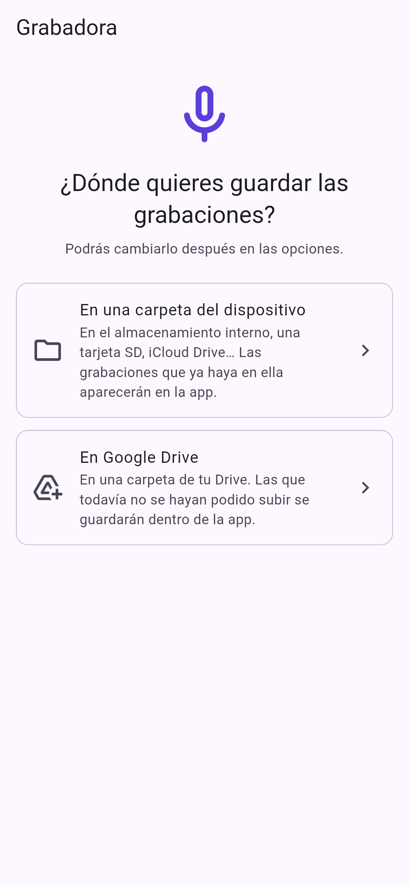

#  Grabadora de voz

Aplicación móvil (Android e iOS) hecha con Flutter para grabar, escuchar y
gestionar notas de voz. Está en español, inglés, italiano, portugués,
francés, alemán, chino y japonés.

<p>
  
  
  
</p>
<p>
  
  
  
  
</p>

## Funciones

- **Menú inicial**: al instalar la app se elige dónde guardar las
  grabaciones, en una **carpeta del dispositivo** o en **Google Drive** (ver
  [Dónde se guardan](#dónde-se-guardan-las-grabaciones)). Hasta elegirlo no
  se puede grabar; si después se deja de usar el destino, vuelve a aparecer.
- **Grabar** con un solo toque, con **pausa/reanudar** y cronómetro.
- **Formato y calidad** (*Opciones → Grabación*): AAC (`.m4a`) o WAV sin
  comprimir, en calidad baja, media o alta (ver
  [Formato y calidad](#formato-y-calidad)).
- **Panel deslizable**: al deslizar hacia arriba el panel del botón de grabar
  se ve el cronómetro y la onda (en gris) **sin empezar a grabar**; se graba al
  pulsar el botón. Al deslizarlo hacia abajo se vuelve a plegar. Desplegado,
  a cada lado del botón:
  - ⏱ **Cuenta atrás** (izquierda): empieza a grabar al cabo de 3, 5 o 10 s
    (*Opciones → Grabación → Cuenta atrás*), vibrando cada segundo.
  - 🗣 **Al detectar la voz** (derecha): empieza a grabar cuando hablas y
    conserva **1 s antes** para que no empiece cortada.

  Mientras se espera, la X cancela y el botón rojo empieza ya.
- **Onda en tiempo real** con el nivel del micrófono. Al grabar solo se
  colorea desde el punto en que empieza la grabación; lo anterior sigue en
  gris. En pausa, lo grabado se atenúa.
- **Descartar** una grabación en curso (con confirmación).
- **Lista de grabaciones** ordenada de la más reciente a la más antigua, con
  fecha («Hoy», «Ayer»…), duración, **formato y calidad** («AAC · 128 kbps ·
  44,1 kHz») y la **onda completa de cada una**. **Tocar el nombre** permite
  cambiarlo.
- **Carpetas**: con el botón de carpetas (arriba a la izquierda) o
  deslizando hacia la derecha en cualquier punto de la lista se abre un menú
  con la carpeta principal y sus **subcarpetas**, con cuántas grabaciones
  tiene cada una, y *Nueva carpeta*. Arrastrar sobre la onda de una
  grabación sigue sirviendo para saltar. En una subcarpeta, su nombre
  aparece en la barra superior (en la principal no hay título), la lista
  muestra sus grabaciones y **se graba en ella**. «Atrás» vuelve a la
  principal.
- **Buscar** con la lupa (a la izquierda de ⚙) o **tirando de la lista
  hacia abajo** cuando ya está arriba: el campo ocupa la barra, desde el
  botón de carpetas hasta ⚙. Busca en los **nombres y las transcripciones**
  de todas las carpetas, sin distinguir mayúsculas ni tildes («reunion»
  encuentra «Reunión») y con cada palabra en cualquiera de los dos. Los
  resultados resaltan lo encontrado, muestran el trozo de la transcripción
  donde aparece y la subcarpeta de cada grabación. La X o «atrás» cierran la
  búsqueda.
- **Reproductor integrado**: la onda hace de barra de progreso; se puede tocar
  o arrastrar para saltar a cualquier punto (también en grabaciones que no se
  están reproduciendo).
- **Modo de edición** (menú de cada grabación → *Editar*):
  - **Recortar** con dos asas sobre la onda.
  - **Subir o bajar el volumen** (de −20 a +20 dB) y **normalizar** (lleva el
    pico de la selección a −1 dBFS). Avisa si el volumen elegido satura.
  - **Fundido de entrada y de salida** (hasta 5 s).
  - Escuchar la selección antes de guardar, **ya con el volumen y los
    fundidos**.
  - **Guardar** (sustituye la original) o **Guardar copia** (crea una
    grabación nueva, «… (editada)», y deja la original como estaba).
- **Transcribir** (menú de cada grabación → *Transcribir*) con el
  reconocimiento de voz del sistema o con **Whisper** en el dispositivo (ver
  [Transcripción](#transcripción)). La tarjeta muestra el principio del
  texto; al tocarlo se abre entero para leerlo, copiarlo, compartirlo,
  volver a transcribir o eliminarlo.
- **Pantalla encendida mientras se graba** (o se espera para empezar), para
  que el sistema no detenga la app al apagarse. Se puede desactivar.
- **Renombrar**, **compartir** (con el nombre que le hayas dado) y
  **eliminar** grabaciones.
- **Opciones** (botón ⚙ arriba a la derecha):
  - **Grabación**: formato, calidad, duración de la cuenta atrás y mantener
    la pantalla encendida.
  - **Carpeta del dispositivo**: dónde se guardan las grabaciones
    (almacenamiento interno, tarjeta SD, iCloud Drive…). La app muestra
    todos los audios que hay en ella y en sus subcarpetas.
  - **Google Drive**: con carpeta, guarda además una copia de cada grabación
    en la carpeta «Grabadora» de tu Drive; sin carpeta, las grabaciones se
    guardan en Drive. Necesita configuración previa (ver
    [Google Drive](#google-drive)).
  - **Transcripción**: con qué se transcribe, el modelo de Whisper
    (descargarlo o borrarlo) y el idioma.
  - **Apariencia**: el tema.
- **Tema** automático (el del sistema, por defecto), claro u oscuro
  (*Opciones → Apariencia → Tema*), con los colores del icono (morado
  `#5B3FD9` y, para grabar, el rojo `#FF4D4D`).
- **Ocho idiomas**: español, inglés, italiano, portugués, francés, alemán,
  chino y japonés. Se usa el del sistema y, si no es ninguno de ellos, el
  inglés (ver [Idiomas](#idiomas)).

La app guarda en su carpeta privada un índice `recordings.json` con el
nombre, la fecha, la duración, la onda, el formato, la subcarpeta, la
transcripción y el archivo de cada grabación en la carpeta del dispositivo o en Drive. El audio
está allí, no en la app (ver
[Dónde se guardan](#dónde-se-guardan-las-grabaciones)).

### Formato y calidad

| Calidad | Frecuencia | AAC (`.m4a`) | WAV (16 bits) |
|---------|------------|--------------|---------------|
| Baja    | 16 kHz     | 32 kbps · 0,2 MB/min | 1,9 MB/min |
| Media   | 22,05 kHz  | 64 kbps · 0,5 MB/min | 2,6 MB/min |
| Alta    | 44,1 kHz   | 128 kbps · 1 MB/min  | 5,3 MB/min |

Siempre en mono. Por defecto, AAC alta (lo que se grababa en versiones
anteriores). Si el micrófono o el códec no admiten exactamente esos valores,
`record` usa los más cercanos; la lista muestra los reales, leídos de la
cabecera del archivo.

Solo afecta a las grabaciones nuevas. Al editar, cada grabación conserva su
formato: un WAV se guarda como WAV y un AAC se vuelve a codificar con su tasa
de bits.

### Grabar al detectar la voz

Al pulsar 🗣 el micrófono empieza a grabar sin mostrarlo, para tener el audio
de antes de que hables. La voz se detecta por el nivel del micrófono: cuando
supera en 12 dB el ruido de fondo (que se estima sobre la marcha) y al menos
−45 dBFS durante 200 ms. Al parar, se quita el principio dejando 1 s antes de
la voz: un `.m4a` se recorta sin volver a codificarlo (`MediaMuxer` en
Android, `AVAssetExportSession` en iOS) y un WAV, en Dart. Si el recorte
fallara, la grabación se guarda entera.

### Transcripción

*Opciones → Transcripción → Transcribir con*:

- **Reconocimiento de voz del sistema** (por defecto): no hay que descargar
  nada.
  - **Android 13 o superior**, con el reconocedor del dispositivo
    (`SpeechRecognizer.createOnDeviceSpeechRecognizer`): el audio se le pasa
    por una tubería en vez del micrófono (`EXTRA_AUDIO_SOURCE`), en una
    sesión segmentada para que admita grabaciones largas, con mayúsculas y
    puntuación. Si el idioma no está descargado, la app ofrece descargarlo
    (el sistema muestra su propio aviso). En Android 12 o anterior, o sin
    reconocedor en el dispositivo, la app propone instalar Whisper.
  - **iOS**: `SFSpeechRecognizer` con el archivo, en el dispositivo si el
    idioma lo admite. Si no, Apple lo reconoce en sus servidores (hace
    falta conexión y el audio sale del móvil), con un límite de un minuto
    por petición, así que la app lo divide en tramos de 55 s.
- **Whisper**, con [whisper.cpp](https://github.com/ggml-org/whisper.cpp)
  (paquete `whisper_cpp_flutter_plus`): en el dispositivo y sin conexión.
  Hay que descargar un modelo una vez desde las opciones: **Tiny** (78 MB,
  más rápido) o **Base** (148 MB, más preciso). Se descargan de Hugging Face
  en una versión fija y se comprueba su suma SHA-256; con el modelo se
  descarga el detector de voz Silero (menos de 1 MB) para que Whisper no
  invente texto en los silencios. La descarga se puede cancelar (se reanuda
  donde se quedó) y el modelo, borrar.

*Idioma*: el de la app (por defecto), uno de los ocho de la app o, solo con
Whisper, detectarlo automáticamente.

Antes de transcribir, el audio se convierte a 16 kHz y un canal (lo que usan
los reconocedores), por bloques y en un isolate aparte. Los audios largos se
dividen cortando en el silencio más cercano al límite: con Whisper, en
tramos de 10 minutos como mucho, para no cargar en memoria más de unos 40 MB
de muestras. Se transcribe una grabación a la vez; la tarjeta muestra el
progreso y se puede cancelar. Con Google Drive como destino, transcribir
descarga el audio (como al escucharlo).

El texto se guarda en el índice de la app con el motor, el idioma y la
revisión del audio: si la grabación se edita o cambia después, la
transcripción avisa de que puede no corresponder.

**En el destino, como `.txt`**: la transcripción se guarda también en un
archivo de texto (UTF-8) junto al audio y con su mismo nombre
(`Clases/Tema 1.txt` junto a `Clases/Tema 1.m4a`), en la carpeta del
dispositivo o en Drive (y en la copia de Drive, si la hay). Se mantiene en
los dos sentidos:

- Volver a transcribir lo sobrescribe, renombrar la grabación lo renombra, y
  eliminar la transcripción o la grabación lo borra.
- Si el `.txt` se **edita fuera de la app** (con cualquier editor), la app
  recoge el texto nuevo; si se borra fuera, la transcripción desaparece de la
  app. Los cambios se detectan como los del audio (tamaño y suma MD5).
- Los `.txt` que ya hay junto a un audio se leen como su transcripción: al
  **reinstalar la app** o desde otro dispositivo, las transcripciones
  vuelven. Con Drive, eso supone descargar esos `.txt` (son pequeños).
- Si el texto cambió en la app sin guardarse todavía y también fuera, gana el
  más reciente. Un `.txt` sin audio con su nombre no cuenta.

### Dónde se guardan las grabaciones

Las grabaciones **viven en el destino elegido**: en la carpeta del
dispositivo o, si no se ha elegido ninguna, en Google Drive. Con nombre de
archivo el que les hayas dado y en su subcarpeta (`Clases/Tema 1.m4a`).

- **Sin copias**: lo que hay en el destino (`.m4a` y `.wav`, en la carpeta y
  en el primer nivel de subcarpetas) aparece en la app tal cual, sin
  copiarlo. Al elegir la carpeta, al volver a la app, al abrir el menú
  lateral y con *Sincronizar ahora* se vuelve a leer.
- **En los dos sentidos**: renombrar, editar o eliminar una grabación en la
  app lo hace en su archivo (en Drive, eliminar la manda a la papelera). Lo
  que se borra en el destino fuera de la app desaparece de la app, lo que se
  cambia se vuelve a leer y lo que se renombra conserva su onda (se reconoce
  por la subcarpeta, el tamaño y, si se conoce, la suma MD5).
- **Cambios hechos fuera de la app**: se detectan por el **tamaño y la suma
  MD5** de cada archivo. Google Drive da la suma al listar, así que no hace
  falta descargar nada. La carpeta del dispositivo no la da: la app guarda
  también la fecha de modificación y, solo si cambia, lee el archivo para
  calcular la suma (si solo cambió la fecha, no lo da por cambiado y lo
  leído queda en la caché).
- **Lo pendiente**: el grabador necesita un archivo local, así que se graba
  dentro de la app y, al parar, la grabación se guarda en el destino. Lo
  mismo al editar. Mientras no se puede guardar (sin conexión, sin permiso,
  tarjeta SD quitada…) se queda en la app y se reintenta al volver a ella o
  con *Sincronizar ahora*. Los errores se ven en las opciones y con un icono
  en la barra superior.
- **Caché**: para escuchar, editar, compartir o calcular la onda, el audio se
  lee del destino (en Drive se descarga) y se guarda en la caché de la app,
  que no pasa de 100 MB: cuando se llena se borra lo que hace más tiempo que
  no se usa, y el sistema también puede vaciarla. Lo recién grabado o
  editado pasa a la caché al guardarse en el destino.
- **Cambiar de destino**: las grabaciones que solo estaban en la app se
  guardan en el nuevo; las del destino anterior **se quedan allí** y dejan
  de verse (si vuelves a elegirlo, aparecen otra vez y la app reconoce sus
  archivos por el nombre y el tamaño, sin duplicarlos). Si se deja de usar
  la carpeta con Drive conectado, la app pasa a usar Drive (donde ya está la
  copia de cada grabación); de Drive a una carpeta, las grabaciones se
  descargan de Drive y se guardan en ella.
- **Copia en Drive**: con la carpeta como destino, Drive guarda una copia de
  cada grabación. Las copias se actualizan al renombrar o editar, pero no se
  borran al eliminar una grabación.
- **Google Drive como destino**: con el permiso `drive.file` la app solo ve
  los archivos que ha creado ella (también desde otro dispositivo), no los
  que se suban a mano a su carpeta. **Para mostrar la lista no se descarga
  nada**: la onda, la duración y el formato de lo que viene de Drive se
  calculan la primera vez que se escucha o se comparte (que es cuando se
  descarga y se queda en la caché). Para escuchar una grabación hay que
  poder descargarla (salvo que esté en la caché).

En Android la carpeta se elige con el selector del sistema y el permiso se
conserva entre reinicios. En iOS se usa el selector de archivos (En mi iPhone,
iCloud Drive…) y un marcador de seguridad.

## Requisitos

- Flutter 3.47 o superior (Dart 3.13).
- Android 7.0 (API 24) o superior.
- iOS 15 o superior.

## Cómo ejecutarla

```bash
flutter pub get
flutter run            # en un dispositivo o emulador conectado
```

Para generar los instalables:

```bash
flutter build apk --release   # Android
flutter build ipa             # iOS (requiere macOS y Xcode)
```

> Si no hay clave de firma configurada, el APK de `release` se firma con la
> clave de depuración. Mira [Firma del APK](#firma-del-apk).

## Permisos

- **Android**: `RECORD_AUDIO` e `INTERNET` (para Google Drive), declarados en
  `android/app/src/main/AndroidManifest.xml`. La carpeta de las grabaciones
  no necesita permisos de almacenamiento: el usuario la elige con el
  selector del sistema.
  El plugin declara además una consulta (`<queries>`) del servicio
  `android.speech.RecognitionService`, para encontrar el reconocedor de voz.
- **iOS**: `NSMicrophoneUsageDescription` y
  `NSSpeechRecognitionUsageDescription` (para transcribir con el
  reconocimiento del sistema), en `ios/Runner/Info.plist`.

El permiso del micrófono se pide la primera vez que se pulsa el botón de
grabar, y el del reconocimiento de voz en iOS, la primera vez que se
transcribe con él. Si se deniegan, la app avisa de que hay que activarlos en
los ajustes.

## Estructura del código

```
lib/
├── main.dart                     Punto de entrada
├── app.dart                      MaterialApp, tema y localización
├── l10n/                         Traducciones (app_xx.arb) y código generado
├── models/
│   ├── recording.dart            Grabación (nombre, duración, onda, archivos fuera de la app…)
│   ├── recording_options.dart    Formato y calidad de grabación
│   └── transcription.dart        Transcripción, motor, modelos de Whisper y opciones
├── audio/
│   ├── levels.dart               Niveles de la onda (dBFS → 0–1) y remuestreo
│   ├── wav.dart                  Lectura y escritura de WAV por bloques
│   ├── audio_edit.dart           Recorte, volumen, fundidos y picos
│   ├── audio_info.dart           Formato y duración de un .m4a o .wav
│   ├── speech_audio.dart         Audio a 16 kHz y un canal y división por los silencios
│   └── voice_detector.dart       Detección de voz por el nivel del micrófono
├── controllers/
│   ├── recorder_controller.dart  Estado de la grabación (cronómetro, onda…)
│   ├── player_controller.dart    Estado de la reproducción
│   ├── transcription_controller.dart  Cola de transcripciones, progreso y cancelación
│   └── whisper_controller.dart   Descarga del modelo de Whisper
├── services/
│   ├── audio_recorder_service.dart  Micrófono (paquete `record`)
│   ├── audio_player_service.dart    Reproducción (paquete `audioplayers`)
│   ├── audio_codec.dart             m4a ↔ WAV y recorte de m4a (sistema)
│   ├── recording_editor.dart        Editar y calcular ondas (en un isolate)
│   ├── recordings_repository.dart   Índice de grabaciones y audio pendiente
│   ├── settings_store.dart          Opciones de la app
│   ├── folder_access.dart           Carpeta elegida por el usuario
│   ├── google_drive.dart            Google Sign-In y API REST de Drive
│   ├── storage_sync.dart            Guardar y leer en el destino (carpeta o Drive) y copia en Drive
│   ├── audio_cache.dart             Caché del audio leído del destino
│   ├── transcriber.dart             Transcribir: preparar el audio, dividirlo y reconocerlo
│   ├── speech_recognition.dart      Reconocimiento de voz del sistema
│   ├── whisper_service.dart         Modelos de Whisper y whisper.cpp
│   ├── screen_awake.dart            Mantener la pantalla encendida
│   └── share_service.dart           Compartir (paquete `share_plus`)
├── screens/                      Pantalla principal, menú inicial, editor, transcripción y opciones
├── widgets/                      Panel de grabación, ondas, lista, menú de carpetas y diálogos
└── utils/                        Formatos de duraciones y fechas, archivos, idiomas y búsqueda

packages/voicerecorder_native/    Plugin propio con el código nativo
├── android/…/AudioCodecHandler.kt   MediaExtractor + MediaCodec + MediaMuxer
├── android/…/FolderAccess.kt        Storage Access Framework (leer, escribir, renombrar y borrar)
├── android/…/SpeechTranscriber.kt   SpeechRecognizer con un archivo (Android 13+)
├── android/…/ScreenAwake.kt         FLAG_KEEP_SCREEN_ON
├── ios/…/AudioCodecHandler.swift    AVAudioFile + AVAssetExportSession
├── ios/…/FolderAccessHandler.swift  UIDocumentPicker + marcadores de seguridad
└── ios/…/SpeechHandler.swift        SFSpeechRecognizer con un archivo
```

La edición funciona así: el `.m4a` se decodifica a WAV con el códec del
sistema (un WAV de 16 bits se usa tal cual), el recorte, el volumen y los
fundidos se aplican en Dart (por bloques y en un isolate aparte, así que no
carga el audio entero en memoria ni bloquea la interfaz) y el resultado se
vuelve a codificar en AAC con la tasa de bits del original (o se guarda como
WAV). La escucha previa usa el mismo procesado sobre la selección. Mientras
se edita, el audio ocupa unos 5 MB por minuto en la carpeta temporal.

Los servicios de audio, el almacenamiento, la carpeta y Drive están detrás de
interfaces, de modo que los tests usan versiones falsas y no necesitan un
dispositivo.

### Idiomas

Los textos están en `lib/l10n/app_xx.arb`; `app_en.arb` es la plantilla (con
la descripción de cada texto) y el inglés, el idioma de respaldo. El código
de `lib/l10n/app_localizations*.dart` lo genera `flutter gen-l10n` (también
`flutter pub get`, `run`, `build` y `test`, por `generate: true`): tras
cambiar un ARB hay que regenerarlo y subirlo.

Para añadir un idioma: copia `app_en.arb` como `app_xx.arb`, tradúcelo (sin
las entradas `@…`), ejecuta `flutter gen-l10n` y añade también:

- Android: `android/app/src/main/res/values-xx/strings.xml` (nombre en el
  lanzador) y el idioma en `res/xml/locales_config.xml`.
- iOS: `ios/Runner/xx.lproj/InfoPlist.strings` (nombre y aviso del
  micrófono), añadido al grupo `InfoPlist.strings` del proyecto de Xcode, y
  el idioma en `CFBundleLocalizations` de `Info.plist`.

`test/l10n_test.dart` comprueba que todos los ARB tienen los mismos textos y
huecos.

### Icono

El original es `docs/icono.svg`. A partir de él:

- **Android 8+**: icono adaptable (`mipmap-anydpi-v26/ic_launcher.xml`) con
  el fondo morado (`values/colors.xml`) y el dibujo como vector
  (`drawable/ic_launcher_foreground.xml`), así se adapta a la forma de cada
  launcher. El punto rojo está algo más cerca del centro que en el SVG para
  que no lo recorte la máscara redonda. `ic_launcher_monochrome.xml` es la
  silueta para los iconos temáticos de Android 13+.
- **Android 7**: los PNG de `mipmap-*/ic_launcher.png`, con las esquinas
  redondeadas del SVG.
- **iOS**: los PNG de `AppIcon.appiconset`, cuadrados y sin transparencia
  (iOS redondea las esquinas).

Si cambia el icono, hay que volver a generar los PNG en todos los tamaños y
copiar los cambios de dibujo a los dos vectores de Android.

## Tests

```bash
flutter analyze
flutter test
```

Hay tests unitarios del procesado de audio (WAV, recorte, volumen, fundidos,
picos, conversión a 16 kHz y división en tramos), de la lectura de cabeceras
WAV y MP4, del detector de voz, del editor, del almacenamiento y la caché, de
la sincronización con la carpeta y con Drive (como destino y como copia,
también la detección de cambios por la suma MD5; la API de Drive se prueba
con un cliente HTTP falso), de la transcripción (con reconocedores falsos),
de los controladores
(también la cuenta atrás y el inicio por voz con su recorte), de los
formatos y de las traducciones, y tests de widgets de los flujos principales
(menú inicial, grabar, desplegar el panel sin grabar, cuenta atrás, voz,
saltar en la onda, editar y escuchar con el volumen, menú de carpetas y
abrirlo deslizando o con su botón, buscar (también tirando de la lista),
pantalla encendida, transcribir y ver la transcripción, opciones, descargar
Whisper, tema, renombrar, eliminar e idioma). Los tests de widgets se ejecutan en español.

## Integración continua (GitHub Actions)

### `build.yml`: tests y compilación

Se ejecuta en cada push a cualquier rama, a mano desde la pestaña *Actions* y
desde `release.yml`:

1. **Tests**: `flutter analyze` y `flutter test`.
2. **Android (APK)** en Ubuntu y **iOS (IPA)** en macOS, en paralelo, solo si
   los tests pasan.

El APK y el IPA quedan como artefactos descargables en la ejecución
(`android-apk` e `ios-ipa`).

### `release.yml`: publicar una versión

*Actions → Release → Run workflow*, elige la rama (normalmente `main`) y qué
parte de la versión subir:

| Incremento | Ejemplo, partiendo de `1.4.2+7` |
|------------|---------------------------------|
| `patch`    | `1.4.3+8`                       |
| `minor`    | `1.5.0+8`                       |
| `major`    | `2.0.0+8`                       |

El workflow calcula la nueva versión a partir de `pubspec.yaml` y compila con
`build.yml`. Solo si la compilación termina bien:

- hace un commit «Versión x.y.z» en la rama con el `pubspec.yaml` actualizado,
- crea la etiqueta `vx.y.z`,
- publica la release de GitHub con el APK y el IPA adjuntos y las notas
  generadas a partir de los cambios.

Si algo falla antes, no se sube ni se etiqueta nada. Si la rama está
protegida, permite que GitHub Actions haga push a ella; si no, el último paso
fallará.

### Firma del APK

Android solo instala una actualización si está firmada con la misma clave que
la versión instalada. Para que cada release pueda instalarse encima de la
anterior, crea una clave una vez y guárdala en los secretos del repositorio
(*Settings → Secrets and variables → Actions*):

```bash
keytool -genkey -v -keystore upload-keystore.jks -keyalg RSA -keysize 2048 \
  -validity 10000 -alias upload
base64 -w0 upload-keystore.jks   # valor de ANDROID_KEYSTORE_BASE64
```

| Secreto                     | Valor                                  |
|-----------------------------|----------------------------------------|
| `ANDROID_KEYSTORE_BASE64`   | El keystore codificado en base64       |
| `ANDROID_KEYSTORE_PASSWORD` | Contraseña del keystore                |
| `ANDROID_KEY_ALIAS`         | Alias de la clave (`upload` en el ejemplo) |
| `ANDROID_KEY_PASSWORD`      | Contraseña de la clave                 |

Guarda una copia del keystore en un lugar seguro: si se pierde, las nuevas
versiones no podrán instalarse encima de las anteriores.

Sin estos secretos el APK se firma con una clave de depuración distinta en
cada ejecución y el workflow muestra un aviso. Para firmar en local, crea
`android/key.properties` (está en `.gitignore`):

```properties
storeFile=/ruta/a/upload-keystore.jks
storePassword=…
keyAlias=upload
keyPassword=…
```

### Google Drive

Para poder conectar Google Drive hay que registrar la app en Google Cloud
una vez. Sin esta configuración la app funciona igual, pero la opción de
Google Drive aparece desactivada.

1. En [Google Cloud Console](https://console.cloud.google.com/), crea un
   proyecto y activa la **Google Drive API**.
2. Configura la **pantalla de consentimiento de OAuth** (tipo *Externo*) y
   añade el permiso `https://www.googleapis.com/auth/drive.file`, que solo da
   acceso a los archivos que crea la app. Mientras esté en modo de prueba,
   añade tu cuenta como usuario de prueba.
3. En *Credenciales*, crea tres **ID de cliente de OAuth**:
   - **Android**: paquete `es.germade.voicerecorder` y la huella SHA-1 de la
     clave con la que se firma el APK
     (`keytool -list -v -keystore upload-keystore.jks -alias upload`).
     Sin los secretos `ANDROID_*` cada compilación de CI usa una clave
     distinta y el inicio de sesión fallará.
   - **Aplicación web**: no hay que configurar nada más; Android lo necesita
     como `serverClientId`.
   - **iOS**: ID de paquete `es.germade.voicerecorder`.
4. En el repositorio, *Settings → Secrets and variables → Actions →
   Variables*, crea estas **variables** (los ID de cliente no son secretos):

   | Variable                  | Valor                                   |
   |---------------------------|-----------------------------------------|
   | `GOOGLE_SERVER_CLIENT_ID` | ID de cliente **web** (`…apps.googleusercontent.com`) |
   | `GOOGLE_IOS_CLIENT_ID`    | ID de cliente **iOS**                   |

`build.yml` los pasa a la app con `--dart-define` y, en iOS, genera el
esquema de URL de vuelta del inicio de sesión (el ID de cliente invertido).
Si faltan, el workflow lo indica con un aviso.

Para probarlo en local:

```bash
flutter run --dart-define=GOOGLE_SERVER_CLIENT_ID=…                 # Android
flutter run --dart-define=GOOGLE_IOS_CLIENT_ID=1234-abc.apps.googleusercontent.com  # iOS
```

En iOS crea además `ios/Flutter/GoogleSignIn.xcconfig` (está en
`.gitignore`) con el ID invertido:

```
GOOGLE_REVERSED_CLIENT_ID = com.googleusercontent.apps.1234-abc
```

### IPA de iOS

El IPA se genera **sin firmar**, porque firmarlo requiere una cuenta de
desarrollador de Apple. Para instalarlo en un iPhone hay que firmarlo al
instalarlo, por ejemplo con [Sideloadly](https://sideloadly.io/) (Mac o
Windows) y una cuenta de Apple:

1. Descarga `voicerecorder-x.y.z.ipa` de la release.
2. Instala Sideloadly. En Windows necesita además iTunes e iCloud
   descargados de la web de Apple (no los de Microsoft Store).
3. Conecta el iPhone por cable y acepta «Confiar en este ordenador».
4. Arrastra el IPA a Sideloadly, escribe tu Apple ID y pulsa *Start*. Si
   tienes Google Drive configurado, no cambies el identificador del paquete
   (`es.germade.voicerecorder`): el inicio de sesión de Google depende de él.
5. En el iPhone: *Ajustes → General → VPN y gestión de dispositivos*, toca
   tu Apple ID y confía en él. En iOS 16 o superior activa también *Ajustes →
   Privacidad y seguridad → Modo de desarrollador* (aparece tras instalar la
   app) y reinicia.

Con una cuenta gratuita la firma caduca a los **7 días** (hay que volver a
firmarla; Sideloadly puede renovarla por wifi si el ordenador está
encendido) y se pueden tener 3 apps así a la vez. Con la cuenta de
desarrollador de Apple (99 € al año) dura un año, y CI podría firmar el IPA
y subirlo a TestFlight. AltStore también sirve, pero cambia el
identificador del paquete y Google Drive no funcionaría.

## Limitaciones conocidas

- La grabación está pensada para hacerse con la app en primer plano (por
  eso la pantalla se mantiene encendida). Para grabar con la pantalla
  apagada haría falta un servicio en primer plano en Android y el modo de
  audio en segundo plano en iOS.
- La detección de voz se basa solo en el nivel del micrófono: un ruido
  fuerte (un golpe, una puerta) también puede empezar la grabación.
- Solo se muestran los `.m4a` (AAC) y `.wav` del destino, y solo de la
  carpeta y del primer nivel de subcarpetas. En la carpeta del dispositivo,
  un cambio con el mismo tamaño solo se detecta si cambia la fecha de
  modificación (casi todos los sistemas la cambian al escribir).
- Con Google Drive como destino, la onda y la duración de lo que se añade
  desde Drive no se ven hasta escucharlo por primera vez.
- Transcripción: el reconocimiento del sistema necesita Android 13 o
  superior; en iOS, los idiomas que no admite en el dispositivo se
  reconocen en los servidores de Apple. Whisper tarda más con audios largos
  y en móviles antiguos (Base, más que Tiny) y no funciona en emuladores
  x86. El `.txt` de la transcripción se empareja con el audio por el nombre:
  si el sistema le añade un sufijo al crearlo («Idea (1).m4a» porque ya
  había otro), el `.txt` se llama como la grabación, no como el archivo.
- No hay forma de mover una grabación a otra subcarpeta desde la app.
- Guardar en el destino y leerlo se hace con la app abierta; no hay subida
  en segundo plano.
