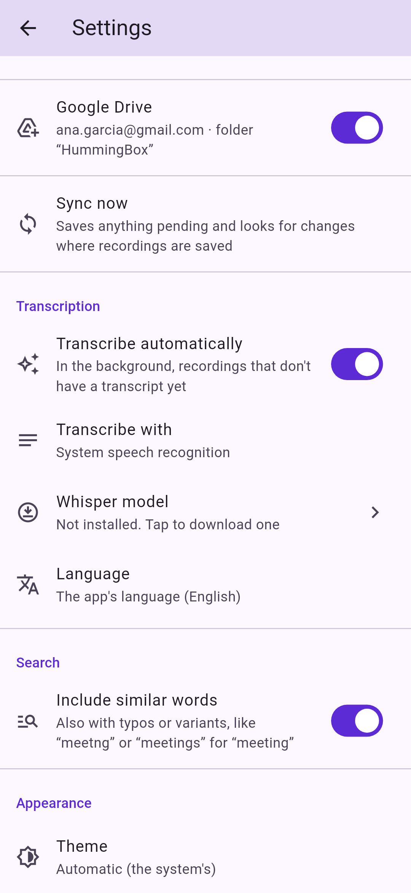
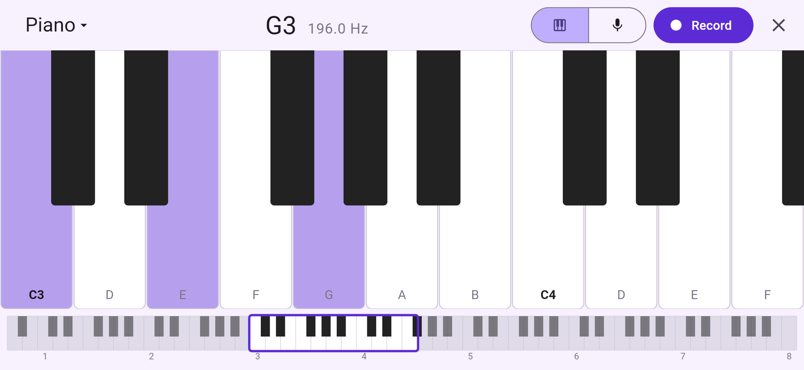
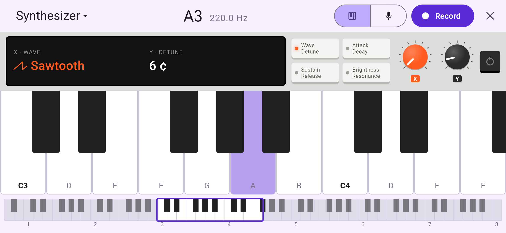

#  HummingBox

A voice recorder for Android and iOS, built with Flutter. Record, play, edit
and transcribe voice notes, and keep them in a folder on your device or in
Google Drive.

<p>
  
  
  
  
</p>
<p>
  
  
  
  
</p>
<p>
  
  
</p>

## Features

- **Record** with one tap, pause and resume, a countdown or **start when you
  speak** (keeping the second before). AAC or WAV in six quality levels, from 8 to 48 kHz.
- **Your files, where you want them**: a device folder (internal storage, SD
  card, iCloud Drive…) or Google Drive, with subfolders. Changes made outside
  the app are picked up.
- **Play and edit**: seek on the waveform, play in a loop or one after
  another, trim, change the volume, normalize and add fades.
- **Piano**: swipe left for a landscape piano to find your notes (in
  portrait it's drawn sideways, so you just turn the phone). Pinch to see
  more or fewer keys. Play it as a piano, organ, guitar, marimba or a
  synthesizer with its own controls. Record it alone, with your voice or
  over a recording; the notes are drawn like
  a MIDI editor and saved as `.mid` files next to the audio.
- **Named for you**: new recordings are named after their date and the first
  words of their transcript (`2026-10-05.Hello, how are you`).
- **Transcribe** automatically, in the background, on the device with the
  system speech recognizer or Whisper. Transcripts are saved as `.txt` files
  next to the audio.
- **Search** recording names and transcripts, in a detailed or compact list.
- Light and dark themes, in English, Spanish, Italian, Portuguese, French,
  German, Chinese and Japanese.

## Install

Download the APK (Android 7.0+) or the IPA (iOS 15+, unsigned) from the
[releases page](https://github.com/germadev/voicerecorder/releases). See
[Installing](docs/install.md).

## Build

Requires Flutter 3.47 or later.

```bash
flutter pub get
flutter run
flutter test
```

## Documentation

- [Features](docs/features.md): everything the app does, and its known
  limitations.
- [Storage](docs/storage.md): where recordings are stored and how they are
  kept in sync.
- [Transcription](docs/transcription.md): engines, languages and `.txt`
  files.
- [Google Drive setup](docs/google-drive.md): registering the app in Google
  Cloud.
- [Installing](docs/install.md): the APK and the IPA.
- [Development](docs/development.md): project structure, tests,
  permissions, localization and the app icon.
- [CI and releases](docs/releases.md): GitHub Actions workflows and APK
  signing.
