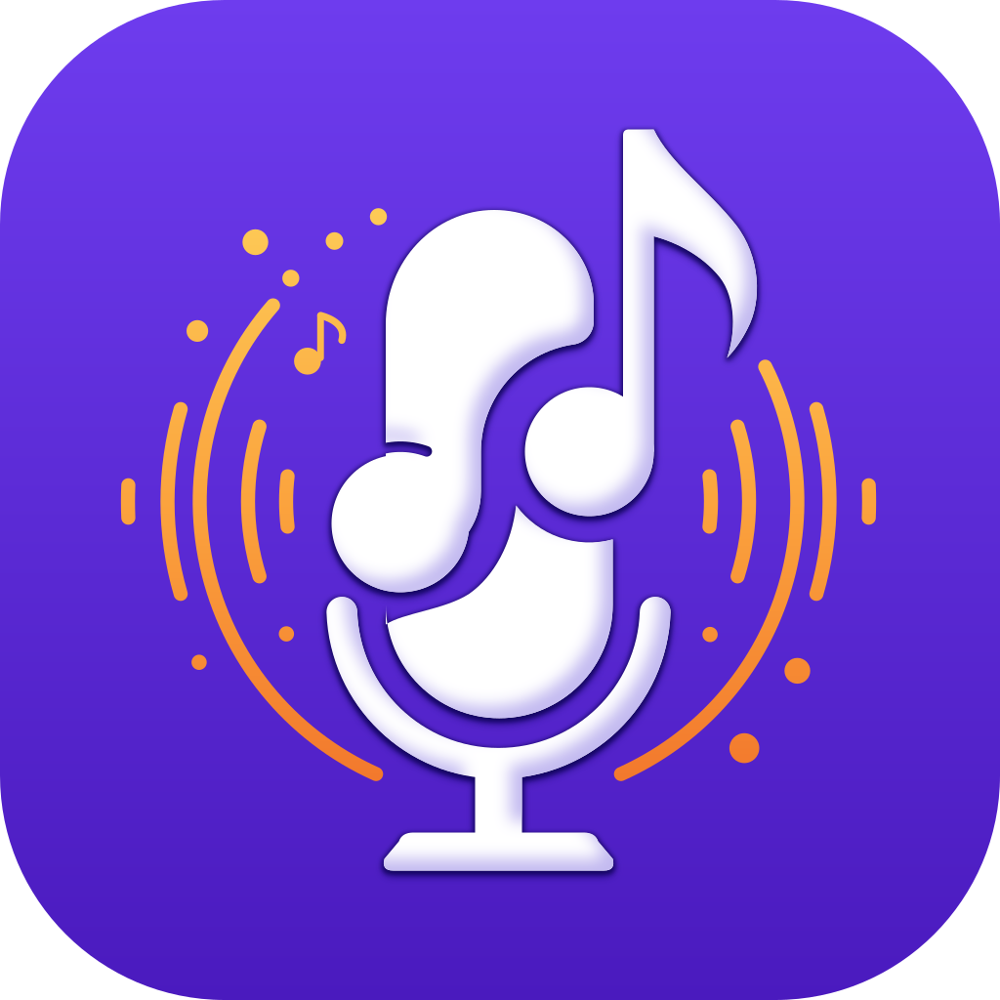
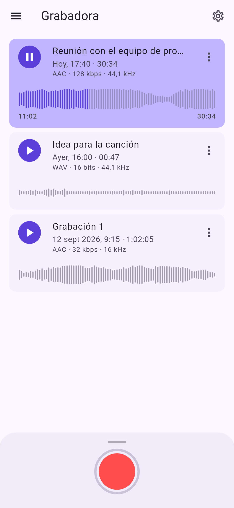
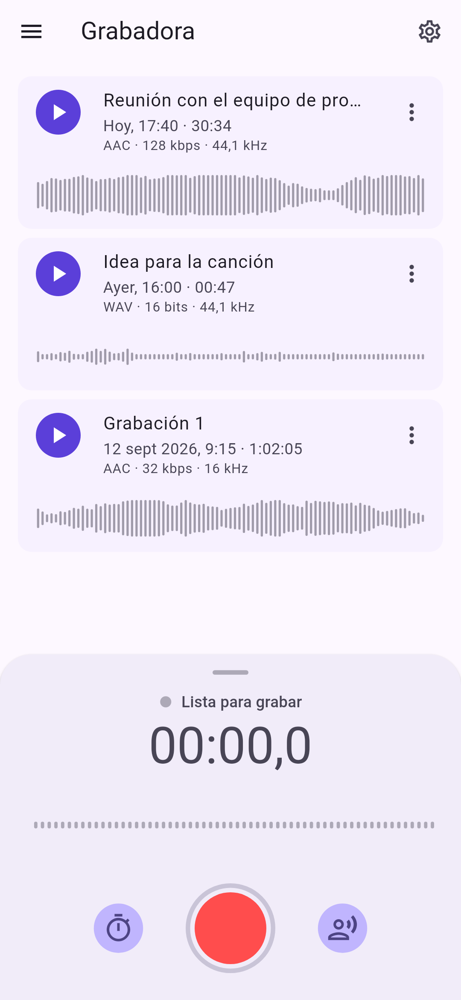
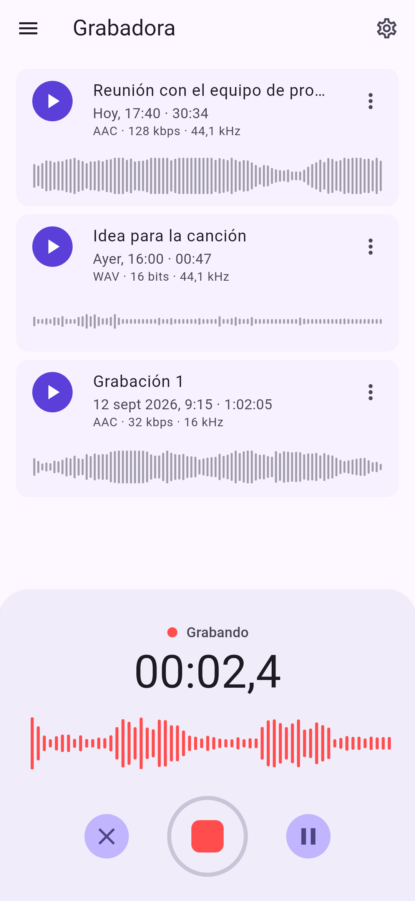
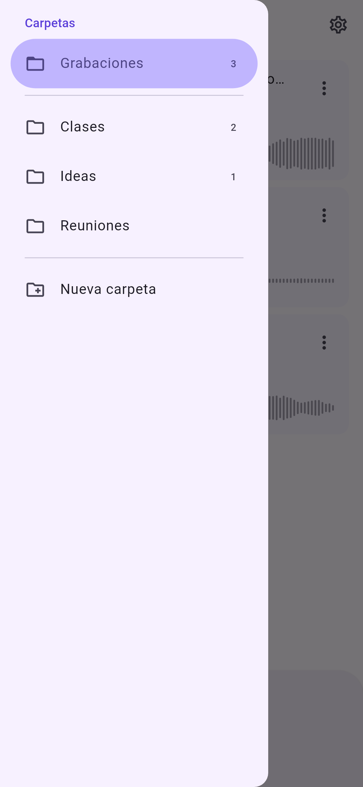
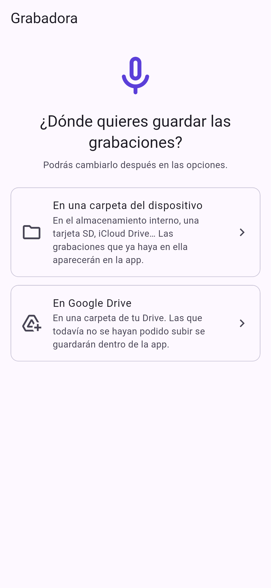
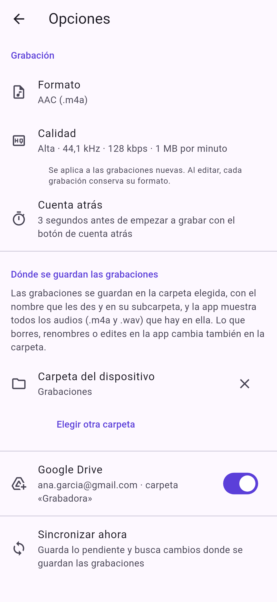

#  HummingBox

A voice recorder for Android and iOS, built with Flutter. Record, play, edit
and transcribe voice notes, and keep them in a folder on your device or in
Google Drive.

<p>
  
  
  
</p>
<p>
  
  
  
  
</p>

## Features

- **Record** with one tap, pause and resume, a countdown or **start when you
  speak** (keeping the second before). AAC or WAV in three quality levels.
- **Your files, where you want them**: a device folder (internal storage, SD
  card, iCloud Drive…) or Google Drive, with subfolders. Changes made outside
  the app are picked up.
- **Play and edit**: seek on the waveform, trim, change the volume,
  normalize and add fades.
- **Transcribe** on the device with the system speech recognizer or Whisper.
  Transcripts are saved as `.txt` files next to the audio.
- **Search** recording names and transcripts.
- Light and dark themes, in English, Spanish, Italian, Portuguese, French,
  German, Chinese and Japanese.

## Install

Download the APK (Android 7.0+) or the IPA (iOS 15+, unsigned) from the
[releases page](https://github.com/germadev/voicerecorder/releases). See
[Installing](docs/install.md).

## Build

Requires Flutter 3.47 or later.

```bash
flutter pub get
flutter run
flutter test
```

## Documentation

- [Features](docs/features.md): everything the app does, and its known
  limitations.
- [Storage](docs/storage.md): where recordings are stored and how they are
  kept in sync.
- [Transcription](docs/transcription.md): engines, languages and `.txt`
  files.
- [Google Drive setup](docs/google-drive.md): registering the app in Google
  Cloud.
- [Installing](docs/install.md): the APK and the IPA.
- [Development](docs/development.md): project structure, tests,
  permissions, localization and the app icon.
- [CI and releases](docs/releases.md): GitHub Actions workflows and APK
  signing.
